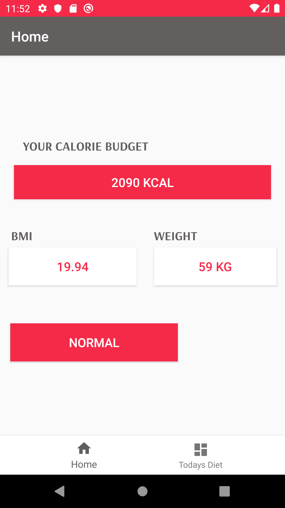
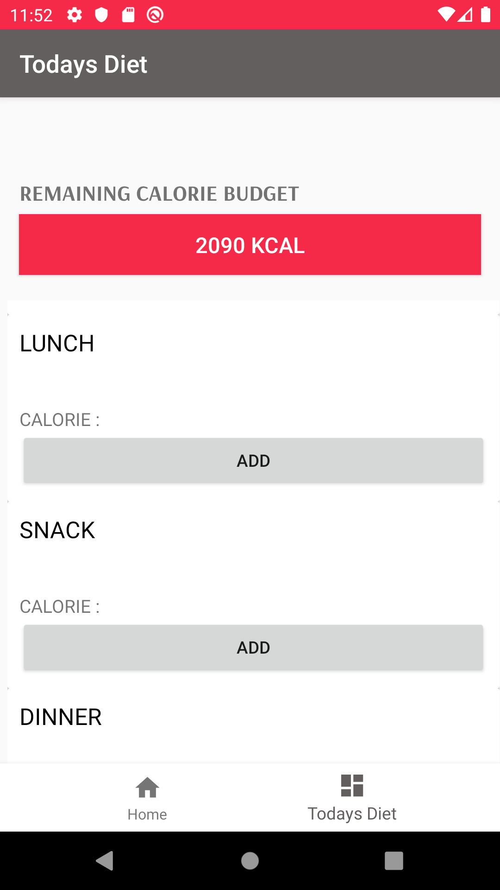

# MobileComputingProject

DAILY DIET PLAN – An android mobile application prototype (Mobile Computing Project CS855)

1)	Description of project:

This project, ‘Daily Diet Plan’ is an android mobile application prototype to integrate the Food Data Central API \cite{API} developed as part of CS 855 Mobile Computing course project requirement. 
The 'Daily Diet Plan' application allows the user to plan their daily meals based on the personal calorie requirements. 
Being a beginner in Android development and Kotlin programming language, this project is proposed to learn and explore the process of API integration, implementation and use of different user interface elements in an android app through facilitating the daily diet plan application requirements.

2) Features list 

The application begins with user information gathering.Provide the daily diet plan application with your information including age in years, sex, height in centimeter, weight in kilogram, and your activity rate in a scale from 1 to 5 as described below. 

• The activity rate selection is from five categories:  

   a.	Not active - If user does little to no exercise and mostly sedentary  
   b.	Lightly active - If user does light exercise like 1 to 3 days per week  
   c.	Active - If user does moderate exercise like 3 to 5 days per week  
   d.	Very Active - If user performs heavy exercise daily or 6 to 7 days per week  
   e.	Heavily active -If user performs very heavy exercise like twice per day or extra heavy workouts  

 • The main screens of Daily diet plan is designed as a bottom navigation application  with two tabs:
   a) Home tab: Displays the values of reccomended calorie estimation, Body mass index (BMI), weight in kiograms and BMI category as status.
   
   
   

   b) ‘Today’s Diet’ tab: Shows the list of food items planned to take for Breakfast, snacks, lunch and dinner. This view alerts on the remaining calorie to spend based on selected diet.
  
• Planning the meals: Initially the ‘Todays Diet’ tab is an empty list where user can add his choice of food. The ‘ADD’ button in each meals takes user to a search screen.

• Search screen: Type in any food item you wish to have. The application returns a list of options with ingredients, brand (if available), amount of food and calorie in Kilo Jules. The food options are from USDA Food Data Central Database.

• Updates on ‘Today’s Diet’ tab: For each food selection the remaining calorie is updated and selected food item is listed.   

  
3)To do list 

a.	Add a settings tab in the bottom navigation with user profile information.  
b.	Ability to edit user information.  
c.	Ability to add more food items in one meal.  
d.	Handle or provide option to enter user height and weight in different units like meters, pounds etc.  
e.	Add option to choose the amount of servings while planning the diet.  
f.	Integrate activity tracker.   

4)Building (List of all libraries used) 

•	Recycler View to list the food items 
•	Retrofit library for the API interaction
• Shared Preferences to save data locally

5)Set up Instructions 
  checkout or download from github  
 

6)Users Manual 
 - Check out this video for the application in operation

7)Contact us:
Pull request are welcome . Please email at ruckiya.sinorina@gmail.com

